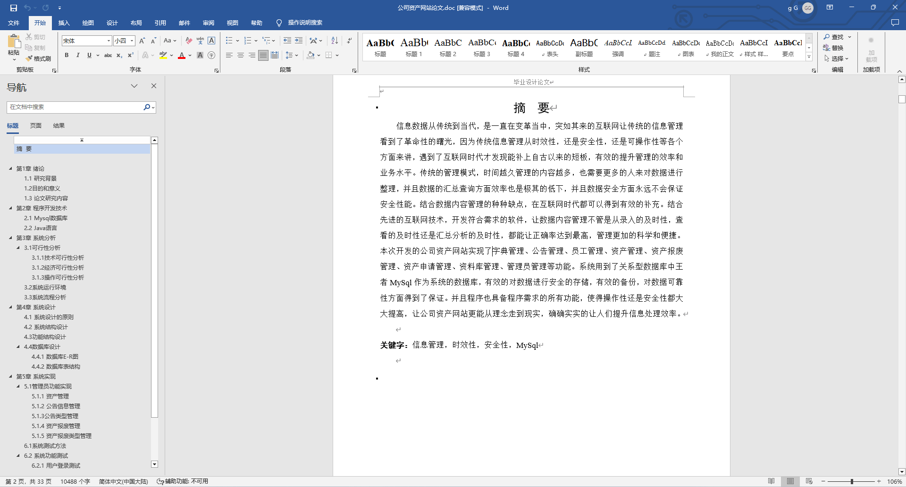
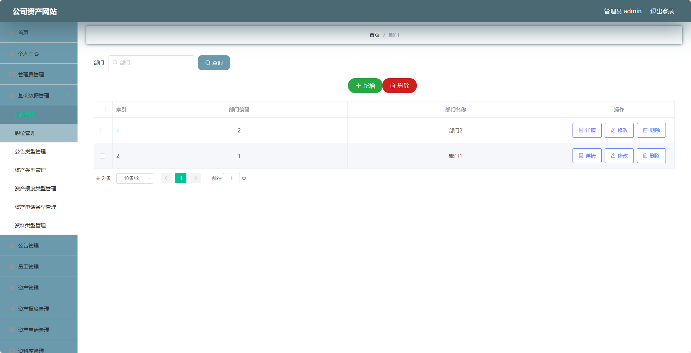
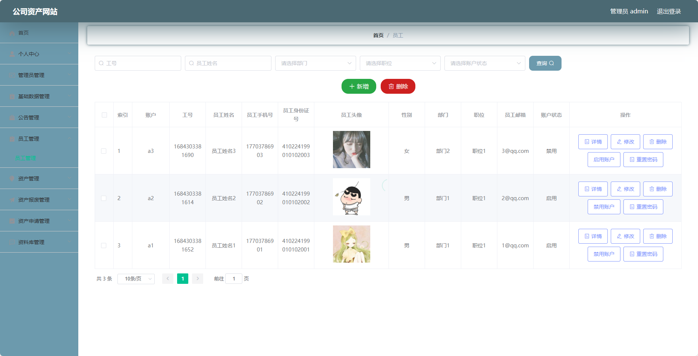
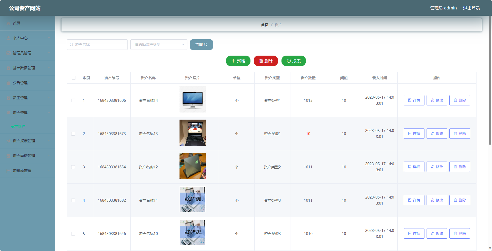
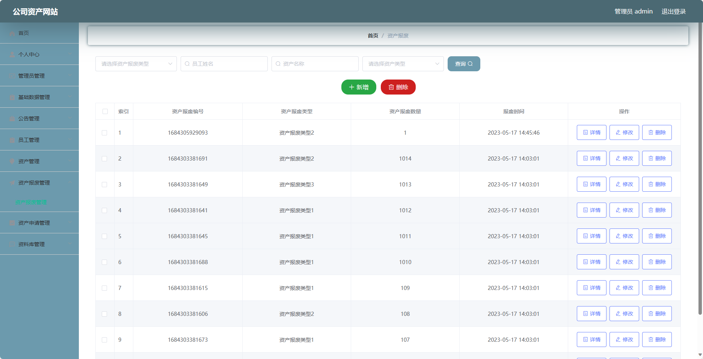
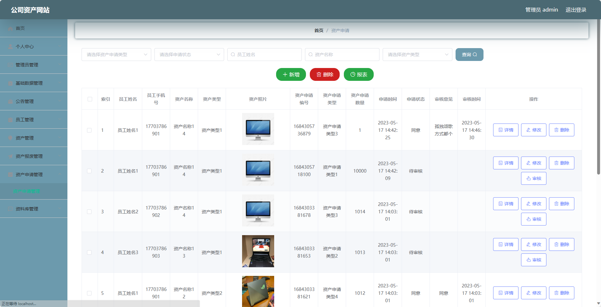
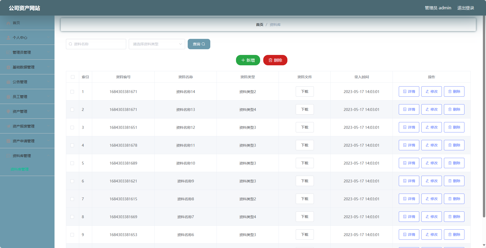

基于Springboot的公司资产网站（程序+论文）
=
### 完整代码获取地址：从戎源码网 ([https://armycodes.com/](https://armycodes.com/))
### 作者微信：19941326836  QQ：952045282 
### 承接计算机毕业设计、Java毕业设计、Python毕业设计、深度学习、机器学习
### 选题+开题报告+任务书+程序定制+安装调试+论文+答辩ppt 一条龙服务
### 所有选题地址https://github.com/nature924/allProject

一、项目介绍
---
基于Spring Boot框架实现的公司资产网站，系统包含两种角色：管理员、员工,主要功能如下。
### 管理员模块：
- 个人中心：管理员可以管理个人信息，包括修改密码等操作。
- 管理员管理：管理员可以管理系统中的管理员账号，包括添加管理员、编辑管理员、删除管理员等操作。
- 基础数据管理：管理员可以管理系统的基础数据，如部门信息、职位信息等。
- 公告管理：管理员可以发布和管理公司的公告信息。
- 员工管理：管理员可以管理系统的员工账号，包括添加员工、编辑员工、删除员工等操作。
- 资产管理：管理员可以管理公司资产信息，包括添加资产、编辑资产、删除资产等操作。
- 资产报废管理：管理员可以管理资产报废流程，包括审核和确认报废申请等操作。
- 资产申请管理：管理员可以管理资产申请流程，包括审批和确认资产申请等操作。
- 资料库管理：管理员可以上传和管理公司的资产资料，包括添加、编辑和删除资料等操作。

### 员工模块：
- 个人中心：员工可以管理个人信息，包括修改密码等操作。
- 公告管理：员工可以查看公司发布的公告信息。
- 资产管理：员工可以查看个人持有的资产信息，包括资产编号、名称、规格等。
- 资产申请管理：员工可以提交资产申请，包括申请新资产、调配资产等操作。
- 资料库管理：员工可以查看和下载公司的资产资料。

二、项目技术
---
- 编程语言：Java
- 数据库：MySQL
- 项目管理工具：Maven
- 前端技术：VUE、HTML、Jquery、Bootstrap
- 后端技术：Spring、SpringMVC、MyBatis

三、运行环境
---
- 操作系统：Windows、macOS都可以
- JDK版本：JDK1.8以上都可以
- 开发工具：IDEA、Ecplise、Myecplise都可以
- 数据库: MySQL5.7以上都可以
- Tomcat：任意版本都可以
- Maven：任意版本都可以

四、运行截图
---
### 论文截图：

### 程序截图：

